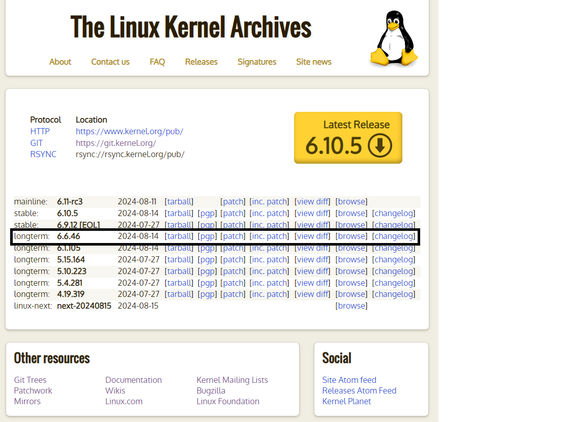
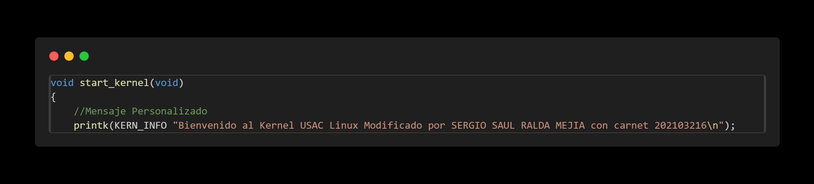
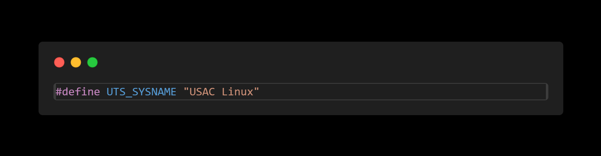
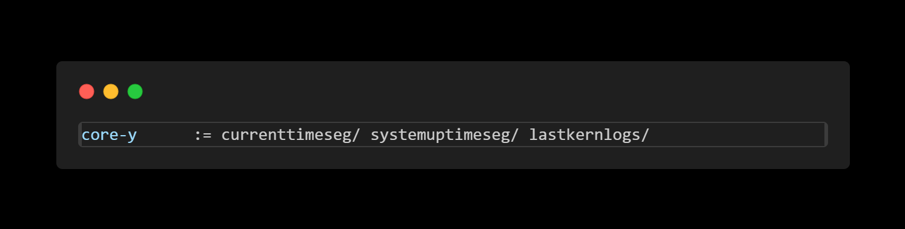

# Practica 1. Introducción al Kernel de Linux

## Objetivos
* Compilar e instalar el kernel de Linux
* Realizar Modificaciones al Kernel de Linux
* Implementar llamadas al sistema (syscalls) personalizadas

## Compilar el Kernel de Linux

Antes de realizar Modificaciones al kernel e implementar syscalls, es importante preparar el entorno donde se trabajara. Se instalaran herramientas para compilar el kernel y se descargara el kernel que servirá como base para las modificaciones e implementaciones del las syscalls.

* ### Instalar Herramientas y paquetes necesarios para la compilación.
    Estas herramientas y paquetes son de suma importancia para el kernel se compile correctamente. Si desea puede investigar para que funciona cada una. Las instalaremos con el siguiente comando

    ```bash
    sudo apt install build-essential libncurses-dev bison flex libssl-dev libelf-dev fakeroot dwarves
    ```

* ### Descargar el Kernel de Linux
    El Kernel de Linux se descargara desde la pagina oficial [kerne.org](https://www.kernel.org/). Descargue la versión mas reciente **longterm** disponible. En esta documentación se utilizara la versión 6.6.45 pero la manera de modificar el kernel e implementar las syscalls es el mismo.

    

    Para descargarlo compie el link de **tarball** y use el comando **wget**.

    ```bash
    wget https://cdn.kernel.org/pub/linux/kernel/v6.x/linux-6.6.46.tar.xz
    ```
    
    Ahora descomprímalo en el directorio donde quiera trabajar.

    ```bash
    tar -xvf linux-6.6.45.tar.xz
    ```

* ### Configurar el Kernel
    Primero se debe ingresar al directorio del código fuente
    ```bash
    cd linux-6.6.44
    ```

    La configuracion que usa el kernel al momento de compilarse esta dado por el archivo .config. Este archivo se tiene que crear. Para crear este archivo se puede utilizar 

    ```bash
    make menuconfig
    ```

    que mostrara una interfaz grafica en la que se puede seleccionar y ajustar varias opciones y caracteristicas del kernel.

    Sin embargo para simplificar el procedimiento, se utilizara el archivo .config que utilizo el kernel actual para compilarse y que se encuntra actualmente instalado.  

    Con el siguiente comando se copiara el archivos .config a el directorio donde usted se encuentra.

    ```bash
    cp -v /boot/config-$(uname -r) .config
    ```

    Sin embargo, este contiene tiene opciones, caracteristicas, modulos y drivers que no se usan en nuestro sistema operativo, ya que este esta hecho para compilar un kernel para diferentes tipos de hardware. Debido a eso, el proceso de compilacion tardaria demasiado, asi que lo que haremos sera modificarlo para que solo compile las opciones, caracteristicas, modulos y drivers que solo esta usando nuestro sistema operativo. Asi el proceso de compilacion sera mas rapido. Cabe decir que si usted desea usar el kernel modificado funcione correctamente en otras computadora, tendria que usar el archivo original o crear uno usando la herramienta anteriormente mencionada. Para modificarlos usaremos el siguiente comando

    ```bash
    make localmodconfig
    ```

    Otro problema es el que al añadir un nuevo modulo o archivos de codigo, estos no cuentan con una firma digital que confirman que son autenticos. Asi que para evitar errores desactivaremos las claves que se encuentran en el archivo .config que verifican esa informacion. Utilizamos el siguiente comando

    ```bash
    scripts/config --disable SYSTEM_TRUSTED_KEYS
    scripts/config --disable SYSTEM_REVOCATION_KEYS
    scripts/config --set-str CONFIG_SYSTEM_TRUSTED_KEYS ""
    scripts/config --set-str CONFIG_SYSTEM_REVOCATION_KEYS ""
    ```
* ### Compilar el Kernel

    Para compilar el kernel usaremos **fakeroot**. Utilizar **fakeroot** es necesario por que nos permite ejecutar el comando **make** en un entorno donde parece que se tiene permisos de superusuario para la manipulación de ficheros. Es necesario para permitir a este comando crear archivos (tar, ar, .deb etc.) con ficheros con permisos/propietarios de superusuario.

    ```bash
    fakeroot make
    ```

    Se puede acelerar la compilacion del kernel utilizando varios nucleos de la CPU con el siguiente comando

    ```bash
    fakeroot make -jN
    ```
    Donde **N/** es el numero de núcleos que desee usar.

    Al finalizar la compilacion utilizaremos el siguiente comando para ver si ocurrio algun error dunrante la compilacion. Si el resultando del comando es **0**, signfica que no hubo errores y podemos instalar el kernel. El comando es

    ```bash
    echo $?
    ```

* ### Instalar el Kernel

    La instalacion se divide en dos partes
    * Instalar los módulos del Kernel
    * Instalar el Kernel mismo

    #### Instalar los módulos del Kernel

    Utilizaremos el siguiente comando

    ```bash
    sudo make modules_install
    ```

    #### Instalar el Kernel mismo

    Utilizaremos el siguiente comando

    ```bash
    sudo make install
    ```
    Por ultimo será necesario reiniciar nuestra computadora. 

    ```bash
    sudo reboot
    ```

* ### Observaciones
    Si el kernel que instalamos es de una versión anterior a nuestro kernel actual del sistema operativo, al iniciar siempre se eligiera automáticamente el que tenga la versión mayor. Para seleccionar la versión del kernel que queremos utilizar podemos acceder al GRUB. Para acceder al GRUB debe investigar que tecla utiliza su distribución y usarla en el arranque del sistema.


## Modificaciones al kernel de Linux
Ya que podemos compilar nuestro kernel, ahora aprenderemos a modificarlos. Las modificaciones que se explican en esta sección serán simples. No reflejan la gran cantidad y complejidad de modificaciones que se pueden realizar. Pero serviran para introducirnos en el kernel de nuestro sistema operativo. 

* ### Menaje Personalizado
    Se imprimirá un mensaje personalizado que se guardara en los logs de nuestro kernel.

    Desde la raiz del codigo fuente abriremos el siguiente archivo 

    ```bash
    nano init/main.c
    ```

    Ya en el archivos, buscaremos **"void start_kernel"**. Esta es un metodo que se ejecuta al iniciar el kernel. Lo que haremos sera un agregar un **"printk"** al inicio del metodo, con cualquier mensaje que queramos. 

     

    Este mensaje lo podremos ver con el siguiente comando

    ```bash
    dmesg
    ```

* ### Nombre del Kernel

    Se modificara el nombre de nuestro Kernel.

    Desde la raiz del codigo fuente abriremos el siguiente archivo
    ```bash
    nano include/linux/uts.h
    ```

    Dentro del archivo podremos encontrar facilmente **"UTS_SYSNAME"**. Que es donde se almacena el nombre de nuestro Kernel. Podemos colocar cualquiera que queramos.

     


## Modificaciones al kernel de Linux
Se explica como crear una nueva syscall e implementarla. También como usarla a nivel de usuario en un programa en lenguaje C. El procedimiento es el mismo para cualquier syscall, lo único que cambia es el código propio de la syscall. Teniendo eso en cuenta, se explicara detalladamente el proceso para la primera sycall y será el mismo para cualquiera.

Ya que el objetivo es: implementar una syscall, no se explicara a fondo el código propio de la syscall. 


* ### Syscall: devuelve la hora actual
    Esta syscall devuelve la hora actual en segundos desde el epoch linux.

    * #### Paso 1
        Crear una carpeta en el directorio del código fuente con el nombre que tendrá la syscall y moverse al directorio creado.

        ```bash
        mkdir currenttimeseg
        cd currenttimeseg
        ```
    * #### Paso 2

        Crear un archivo **.c** con el nombre de la syscall en el directorio actual.

        ```bash
        nano currenttimeseg.c
        ```

        Dentro de este archivo hira el codigo propio de la syscall.
        El codigo para la syscall es

        ```c
        #include <linux/kernel.h>
        #include <linux/syscalls.hc
        #include <linux/time.h>

        SYSCALL_DEFINE0(currenttimeseg)
        {
            struct timespec64 ts;
            ktime_get_real_ts64(&ts);
            return ts.tv_sec;
        }
        ```

        Se utiliza la funcion interna del kernel **"ktime_get_real_ts64"** para obtener la hora actual en segundos. Tambien un **struct** de tipo **timespec64** para guardarla y retornarla.

    * #### Paso 3
        Crear un **Makefile** en el directorio actual.

        ```bash
        nano Makefile
        ```
        Tendrá la siguiente linea.

        ```
        obj-y := urrenttimeseg.o
        ```

        Esto es para garantizar que el archivo  **currenttimeseg.c** se compile e incluya en el codigo fuente del Kernel.

    * #### Paso 4
        Añadir el directorio **currenttimeseg/** al **Makefile** del Kernel.

        Primero volver al directorio del codigo fuente del kernel y abrir el archivo **Makefile**.

        ```bash
        cd ..
        nano Makefile
        ```

        Buscar **"core-y"** dentro del archivo. 
        Encontraremos la siguiente linea

        

        En esta linea agregaremos el directorio que creamos anteriormente: **currenttimeseg/**. Tiene que haber un espacio entre cada directorio que se agrega a la linea.
        
    * #### Paso 5
        Agregar la syscall a la tabla de syscalls del sistema.

        Si está en un sistema de 32 bits, deberá cambiar 'syscall_32.tbl'. Para 64 bits, cambie 'syscall_64.tbl'

        Abra el archivo con el siguiente comando

        ```bash
        nano arch/x86/entry/syscalls/syscall_64.tbl
        ```

        En la ultima linea del archivo agregar la siguiente linea

        ```
        548 64 currenttimeseg sys_currenttimeseg
        ```

        Tiene que ser el mismo nombre de la syscall. Guarde y salga del archivo.
    * #### Paso 6
        Agregar la syscall al archivo de encabezado de syscalls.

        Abra el archivo con el siguiente comando.

        ```bash
        nano include/linux/syscalls.h
        ```

        Añadir la siguiente linea al final del documento antes del **#endif**.

        ```c
        asmlinkage long sys_currenttimeseg(void);
        ```

        Guardar y salir de archivo. Estos son todos los paso para implentar una syscall al kernel. Ahora solo tiene que compilar el kernel.
        


* ### NOTA: Para las siguiente 2 syscall solo se indicara que se tendrá que colocar en cada archivo, ya que el procedimiento es el mismo. 

* ### Syscall: devuelve el tiempo de actividad del sistema
    Esta syscall devuelve el tiempo de actividad del sistema desde el ultimo reinicio.

    * #### Archivo **.c** con el nombre de la syscall.

        ```c
        #include <linux/kernel.h>
        #include <linux/syscalls.h>
        #include <linux/timekeeping.h>

        SYSCALL_DEFINE0(systemuptimeseg)
        {
            struct timespec64 uptime;
            ktime_get_boottime_ts64(&uptime);
            return uptime.tv_sec;
        }
        ```

    * #### Archivo **Makefile**
        ```bash
        obj-y := systemuptimeseg.o
        ```


    * #### Agregar al archivo **Makefile** del Kernel
        

    * #### Agregar la syscall a la tabla de syscalls del sistema
        ```
        549 64 systemuptimeseg sys_systemuptimeseg
        ```
    * #### Agregar la syscall al archivo de encabezado de syscalls.

        ```c
        asmlinkage long sys_systemuptimeseg(void);
        ```

* ### Syscall: Recupera los últimos mensajes del kernel
    Esta syscall recupera los últimos 5 mensajes del log del kernel

    * #### Archivo **.c** con el nombre de la syscall.

        ```c
        #include <linux/kernel.h>
        #include <linux/syscalls.h>
        #include <linux/fs.h>
        #include <linux/slab.h>
        #include <linux/uaccess.h>

        #define LOG_FILE_PATH "/var/log/kern.log"
        #define LOG_LINES 5
        #define BUFFER_SIZE 2048

        SYSCALL_DEFINE1(lastkernlogs, char __user *, buffer)
        {
            struct file *file;
            loff_t pos = 0;
            char *kernel_buffer;
            int size = 0;

            kernel_buffer = kzalloc(BUFFER_SIZE, GFP_KERNEL);
            if (!kernel_buffer)
                return -ENOMEM;

            file = filp_open(LOG_FILE_PATH, O_RDONLY, 0);
            if (IS_ERR(file)) {
                kfree(kernel_buffer);
                return PTR_ERR(file);
            }

            pos = vfs_llseek(file, -BUFFER_SIZE, SEEK_END);
            size = kernel_read(file, kernel_buffer, BUFFER_SIZE, &pos);

            filp_close(file, NULL);

            if (size >= 0) {
                int count_lines = 0;
                int pos_buffer = 0;
                for (int i = BUFFER_SIZE-1 ; i >= 0; i-- ){
                    if (kernel_buffer[i] == '\n'){
                        count_lines++;
                        if (count_lines > LOG_LINES){
                            pos_buffer = i;
                            break;
                        }
                    }
                }
                size = BUFFER_SIZE - (pos_buffer + 1);
                if (copy_to_user(buffer, &kernel_buffer[pos_buffer + 1], size)) {
                    kfree(kernel_buffer);
                    return -EFAULT;
                }
            }

            kfree(kernel_buffer);
            return size;
        }

        ```

    * #### Archivo **Makefile**
        ```bash
        obj-y := lastkernlogs.o
        ```


    * #### Agregar al archivo **Makefile** del Kernel
        

    * #### Agregar la syscall a la tabla de syscalls del sistema
        ```
        550 64 lastkernlogs sys_lastkernlogs
        ```
    * #### Agregar la syscall al archivo de encabezado de syscalls.

        ```c
        asmlinkage long sys_lastkernlogs(char __user *buffer);
        ```